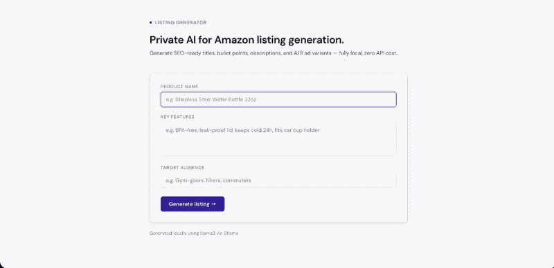

# 🧠 AI Amazon Listing Generator (Local LLM)

A lightweight AI tool that generates high-converting Amazon listings — including titles, bullet points, descriptions, and A/B ad variants — using a **local LLM (Llama3 via Ollama)**.

---

## Demo



---

## Features

* Generate **SEO-optimized product titles**
* Create **bullet points and descriptions**
* Produce **A/B ad variants for testing**
* Runs **fully locally (no API, no cost, no data leakage)**
* Clean UI with **copy-to-clipboard support**
* Handles **unstructured LLM output reliably**

---

## Tech Stack

* **Frontend:** HTML, CSS, Vanilla JS
* **Backend:** Node.js (Express)
* **LLM:** Llama3 via Ollama

---

## How it works

1. User inputs product details
2. Backend sends prompt to local LLM (Ollama)
3. LLM generates structured content
4. Backend extracts valid JSON from response
5. Frontend renders results cleanly

---

## Challenges & Solutions

### 1. Unreliable LLM JSON output

* Issue: Model returned extra text along with JSON
* Fix: Implemented regex-based JSON extraction fallback before parsing

### 2. Frontend data mismatches

* Issue: Arrays vs strings caused rendering errors
* Fix: Added type-safe handling and structured rendering

### 3. Hanging requests

* Issue: Missing response caused loader to freeze
* Fix: Ensured proper API response handling (`res.json`)

---

## Setup

### 1. Install Ollama

https://ollama.com

```bash
ollama pull llama3
```

### 2. Run backend

```bash
npm install
node server.js
```

### 3. Open frontend

Just open `index.html` in browser

---

## Why this project

Built to simulate a real-world AI product like Pixii:

* Focus on **conversion-driven content**
* Emphasis on **A/B testing**
* Demonstrates **practical LLM integration**
* Prioritizes **robustness over ideal assumptions**

---

## Notes

* Designed as a **focused MVP**, not a full SaaS product
* Optimized for **clarity, speed, and demoability**
